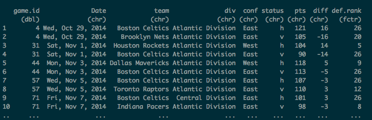
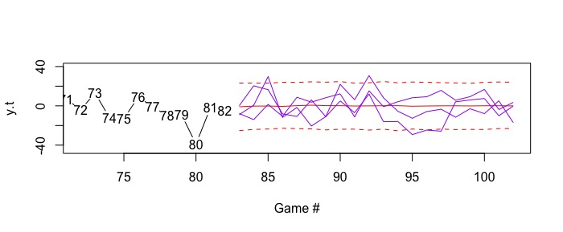
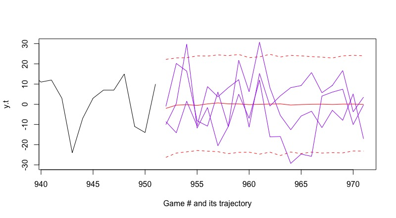

```{r setup, include = FALSE}
knitr::opts_chunk$set(echo = TRUE)
library(rjags)
library(R2jags)
library(dplyr)
library(tidyr)
library(astsa) # time series?
library(knitr)
g1 <- tbl_df(read.csv(file = "../data/g1.csv"))
g2 <- g1 %>% filter(team == "Boston Celtics")
g2$game.id <- seq(from = 1, to = 82, by = 1)
celt.comp <- read.csv(file = "../data/celtics_compiled.csv")[, 3] # only the diff
```

## Introduction

**Completed by Tom.**

## Data Scraping, Cleaning, and Management

One would think that the most popular place to collect data is from ESPN. Unfortunately, the site is not user-friendly for those looking to do their own analyses, but rather for those who simply want to view the box-scores. Luckily, we were familiar with other sports web sites and chose to scrape data from the site [sports-reference.com][sports-reference.com]. 

In the most simple of terms, we needed data that identified a game, the two teams that played this game, and their respective scores. From there, we could calculate our response variable of interest, *score differential*, which is calculated by taking the difference of scores. Below is a screen shot of the website.

<p align="center"></p>

After using the `rvest` library and two of its functions, we're able to extract the data and place it into a suitable dataframe that we can work with in `R`. Here is a screen shot.

<p align="center"></p>

The libraries `dplyr` and `tidyr` were also crucial in cleaning the data by renaming variables, deleting columns, switching data from a wide to long format, adding attributes to each team, and lastly, filtering data by team, which we did throughout this project in order to focus on the local team, the Boston Celtics. 

## Time Series Comparison of the Frequentist and Bayesian AR(1) Process

### 2014 - 2015 Season

For our initial analysis, team member Steele Valenzuela initially explored and exhausted exploratory analyses on how to fit an AR(1) process on observed data, particulary *score differential*, which was the $y_t$. For homework 7, a Bayesian AR(1) process was utilized for simulated data, but not observed data, which is why this initial process was undertaken and then later applied to the compiled dataset featuring additional games from the 2003-04 to 2014-15 seasons. Below is a time series plot of the Boston Celtics 2003-2004 season with *score differential* as $y_t$, observed at each of the 82 games.

```{r time-series-plot, fig.align = 'center'}
yt <- as.numeric(g2$diff)
y <- ts(g2$diff)
plot(yt, type = "b", ylim = c(-40, 40), ann = FALSE)
title(main = list("Boston Celtics 2014-2015 Season and Results", cex = 1.5),
     xlab = list("Game #", cex = 1.5), ylab = list("Score Differential", cex = 1.5))
abline(h = 0, col = "red", lwd = 3)
axis(side = 1, at = seq(10, 82, 10))
```
Can we infer anything from this plot? Maybe not as it does appear to be a sequence of random variables over 82 games.

Let's investigate further with a plot of the auto-correlation function. 
```{r acf-plot, fig.align = 'center'}
# lag1.plot(y, 1) # we don't see any relationship # unsure of the importance of this. probably leave it out
acf(yt, xlim = c(1, 82), lag.max = 82)
```
The correlation between one game, between two games, and so on, does not present a clear pattern.

Next, let's estimate $\sigma$ and $\rho$. If we use the built-in functions in `R`, we can create a lag varible, which is then fit in a model against our original response variable $y_t$, which outputs $\rho$. Additionally, $\rho$ and $\sigma$ can be obtained from the `arima(...)` function as seen below.
```{r, error = TRUE}
ylag1 <- lag(y, 1)
y1 <- cbind(y, ylag1)
(ar1fit <- lm(as.numeric(y1[, 1]) ~ as.numeric(y1[, 2])))
arima(x = yt, order = c(1, 0, 0))
```
For both outputs, we see that $\rho = 0.058$. For the last output, $\sigma = \sqrt{135.3} = 11.63$. $\sigma$ and $\rho$ are found by frequentist methods, specifically maximum likelihood or minimize conditional sum-of-squares, which is beyond the scope of this class.[*citation*]

Now, onto a comparison of the Bayesian AR(1) process. Let us propose the following model:
$$y_t \sim AR(1)$$
$$\rho \sim U(-1, 1)$$
$$\sigma \sim U(0, 15)$$

By constraining $\rho$ between -1 and 1, we are assuming a stationary process for $y_t$. In the frequentist method, $\sigma$ was estimated to be 11.63, hence the upper bound is set to be larger with a value of 15. In order to begin the process, we must estimate $y_1$. Using the stationary distribution, $y_1 \sim N(0, \sigma^2/(1 - \rho^2))$, which follows in setting up the remainder of the $y_t$'s. Our results for the model fit are as follows:

```{r ar1-model-fit, echo = FALSE}
tbl1 <- data.frame(freq.param = c(11.632, 0.058),
                  mean = c(11.895, 0.059),
                  sd = c(0.962, 0.114), 
                  "Lower Bound" = c(10.181, -0.173), 
                  "Upper Bound" = c(13.960, 0.282), 
                  "freq Lower Bound" = c(NA, 0.058 - 1.96*0.111), 
                  "freq Upper Bound" = c(NA, 0.058 + 1.96*0.111))
row.names(tbl1) <- c("sigma", "rho")
kable(tbl1)
```

For convergence diagnostics on both $\sigma$ and $\rho$, traceplots checked out, $N_{eff}$ was equivalent to 4,000 and 1500, respectively, and the $\hat{R}$ was close to 1. As for the model fit, we see that the Bayesian methods produced estimates close to the frequentist estimates as the mean for $\sigma$ and $\rho$ are relatively close. We see for the Bayesian AR(1) process, the 95% credible interval is wider than the frequentist interval. Not shown here, but the reported median was 11.812 and 0.061 for $\sigma$ and $\rho$. 

Lastly, to mirror the notes on Time Series for observed data, forecasted trajectories were created. From the slides, we see that given a posterior sample $\rho^{(s)}$ and $\sigma^{(s)}$, one forecast trajectory $y_{t+p}^{(s)}$ for $p \geq 1$ can be obtained as follows:

$$y_{t+p}^{(s)}|\rho^{(s)}, \sigma^{(s)} \sim N(\rho^{(s)} y_{t+p-1}^{(s)}, \sigma^{(s)2})$$

where $y_t^{(s)} = y_t$ (observed). In this particular case, $t = 82$, or the 82nd game, and $p=20$, or a trajectory of 20 games up to 102 games. Here is the following forecast:

<p align="center"></p>

Up to game 82, we see the observed score differential, the red solid line is the point forecast, which is close to zero, the red-dotted lines are the 95% predictive interval for the point forecast, and the purple lines indicate example trajectores, which we see cross the bounds of the predictive intervals and is just all over the place, as expected. 

### Compiled Season of the Boston Celtics

Next, let's view a larger data set, which includes the score differential for the Boston Celtics from seasons 2003-2004 to 2014-2015, 951 games. Although we could have only included a fully-fitted model, we first worked with data that involved a single season due to the meticulousness of collecting multiple seasons, but it was completed. 

Similar to the previous section with only the 2014 - 2015 season, our parameters $\sigma$ and $\rho$ will utilize the same prior distributions. Convergence and traceplots have checked out, so there is no need to report any concerns. Here are the results:

```{r ar1-cc-fit, echo = FALSE}
tbl2 <- data.frame(freq.param = c(12.566, 0.134),
                  mean = c(12.677, 0.150),
                  sd = c(0.299, 0.032), 
                  "Lower Bound" = c(12.117, 0.088), 
                  "Upper Bound" = c(13.273, 0.213), 
                  "freq Lower Bound" = c(NA, 0.134 - 1.96*0.032), 
                  "freq Upper Bound" = c(NA, 0.134 + 1.96*0.032))
row.names(tbl2) <- c("sigma", "rho")
kable(tbl2)
```

Again, similar analyses, but we can dissect this. First, we notice that that the frequentist and Bayesian $\rho$ differ by 0.016. This may or may not seem like a significant difference, but one would think that as more data was collected, the estimates would line up closer to one another, like the analyses for the 2014 - 2015 season. Additionally, we see the 95% credible intervals differ from the 95% confidence intervals, which may be due to the shift in $\rho$ estimates.

Lastly, let us add the forecasted trajectory:

<p align="center"></p>

Again, we see sampled trajectories shoot all over the place. If time allotted, one reason that forecasted trajectories may deem themselves pertinent could be if a team qualifies for the playoffs, how will the score differential of the last game of the season, or the second to last game of the season effect the score differential of the beginning of the play-offs.

## Address of Email Questions

Below are Prof. Alkema's questions post-presentation and our response.

1. Why include the results of AR(1) to 2014-15? Why not include just the model fitted to all seasons?


2. It wasn't clear to me what was going on in the splines model:

  - To confirm: Is your response variable still the score differential? And x-variable is the ranking? And different models are fitted for different coaches?
  
  
  
  - From the slides, it sounded like you were exploring whether to add an AR(1) to the splines model (to $\mu_i$), which sounds like a good idea, do you plan to do that for the final report?
  
  
  
